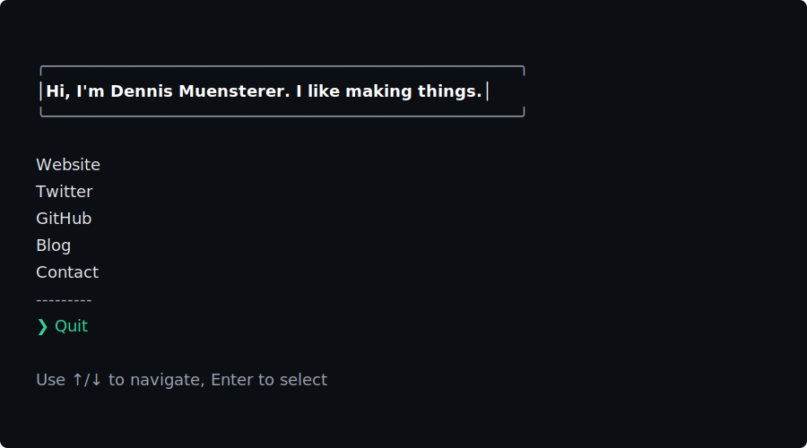

# dnnsmnstrr-cli

An interactive terminal card for Dennis Muensterer, built with Ink.

## Usage

- Run with npx:

```sh
npx dnnsmnstrr
```

- Or install globally:

```sh
npm i -g dnnsmnstrr
dnnsmnstrr
```

## Development

Requirements: Node.js 18+.

- Start in dev mode (ESM + JSX via tsx):

```sh
npm start
```

Preview:



- Build distributable binary (bundled with esbuild):

```sh
npm run build
node dist/cli.cjs
```

Notes:
- Source lives in `source/` and uses ESM + JSX.
- Dev runs with `tsx`; publish build uses `esbuild` and outputs `dist/cli.cjs` with a shebang and `bin` entry.

## Publish

The `prepare` script builds on install/publish. Typical flow:

```sh
npm version patch
npm publish
```

## Credits

Inspired by [Sindre Sorhus](https://sindresorhus.com)
